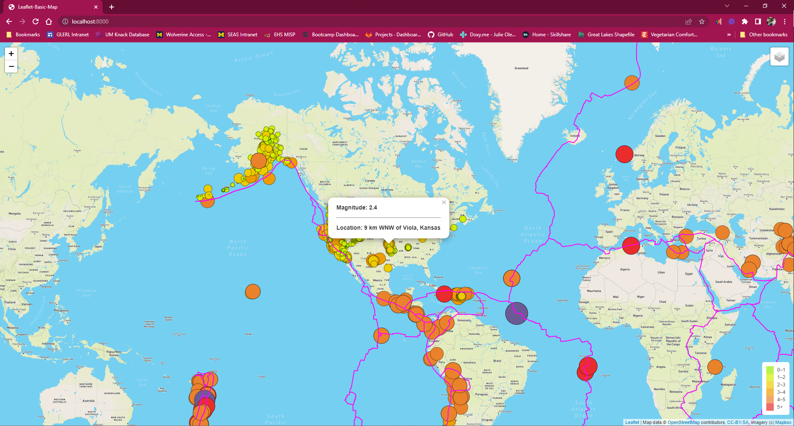
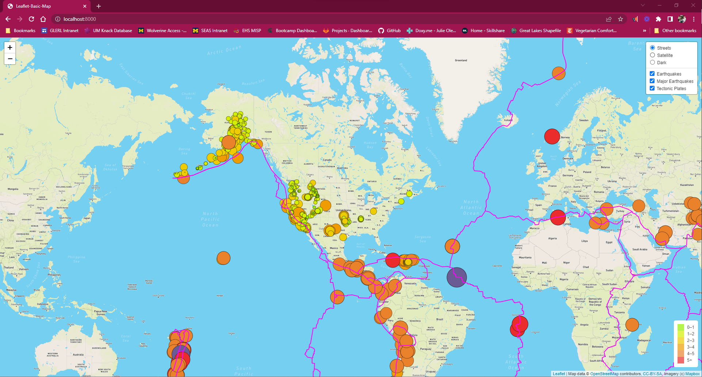
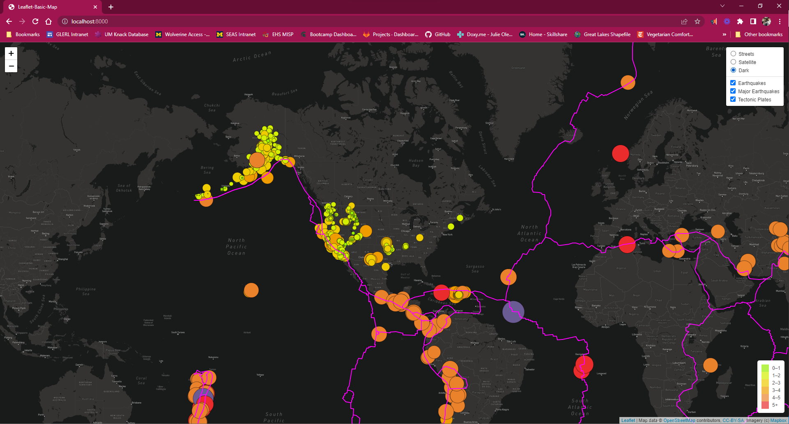
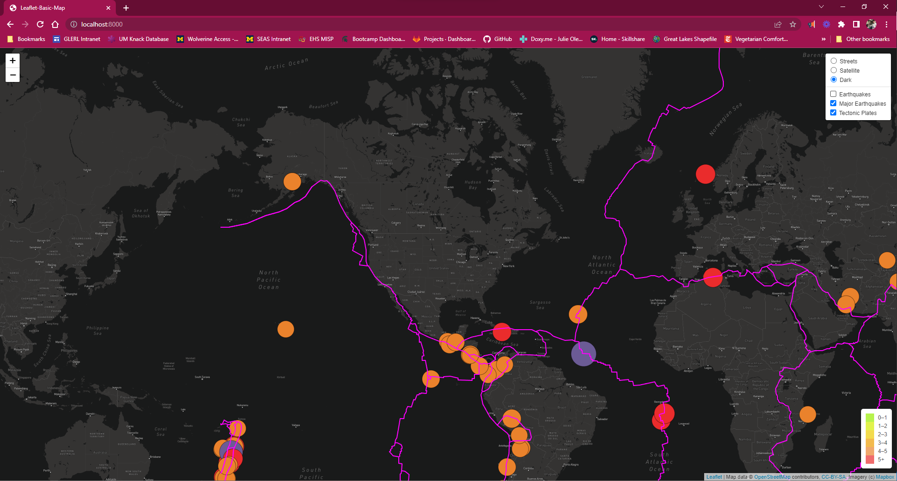

# Mapping Earthquakes
Interactive map showing showing earthquake impacts using JavaScript and mapbox. Earthquake data is obtained from [USGS](https://earthquake.usgs.gov/earthquakes/map/?extent=21.77991,-130.16602&extent=51.91717,-59.85352).

## How to Use
### Setup
Clone the "Earthquake_Challenge" subdirectory onto a local device. In the terminal, navigate to the "Earthquake_Challenge" directory. Create a new file called "config.js" in the "js" directory (nested inside the "static" directory). Add the following to the config.js file:

<code>// API key
const API_KEY = "";</code>

To utilize this code, users will need to create an account with [Mapbox](https://www.mapbox.com/) and aquire an API key. Copy the api key and paste it between the quotation marks in the config.js file. Once this is done, execute the following code in Git Bash:

<code>python -m htpp.server</code>

Open the web browser and navigate to http://localhost:8000/. If everything is setup correctly, a map should open in the browser that looks like the following:

### Navigating Map
Three major features are overlayed on this map: all earthquake locations, major earthquake locations (greater than 4.5 magnitude), and tectonic plates.

The color and size of the markers correlate to the magnitude of the earthquake. Clicking on any marker will open a popup window with information on the magnitude and location of the event. Clicking on a tectonic plate line will open a popup with info on the name of the line and which two plates make up the line.

To change the basemap, click on the layers button in the upper right hand corner of the window. A dropdown window will appear.

Choosing any of the basemap layers will cause the map to update automatically.

To turn layers on and off, click on the checkboxes.

## Resources
All Earthquake Data: [USGS](https://earthquake.usgs.gov/earthquakes/feed/v1.0/summary/all_week.geojson)  
Major Earthquake Data: [USGS](https://earthquake.usgs.gov/earthquakes/feed/v1.0/summary/4.5_week.geojson)  
Tectonic Plate: [Hugo Ahlenius, Nordpil and Peter Bird](https://github.com/fraxen/tectonicplates)  
Basemap Layers: [Mapbox.com](https://www.mapbox.com/)

